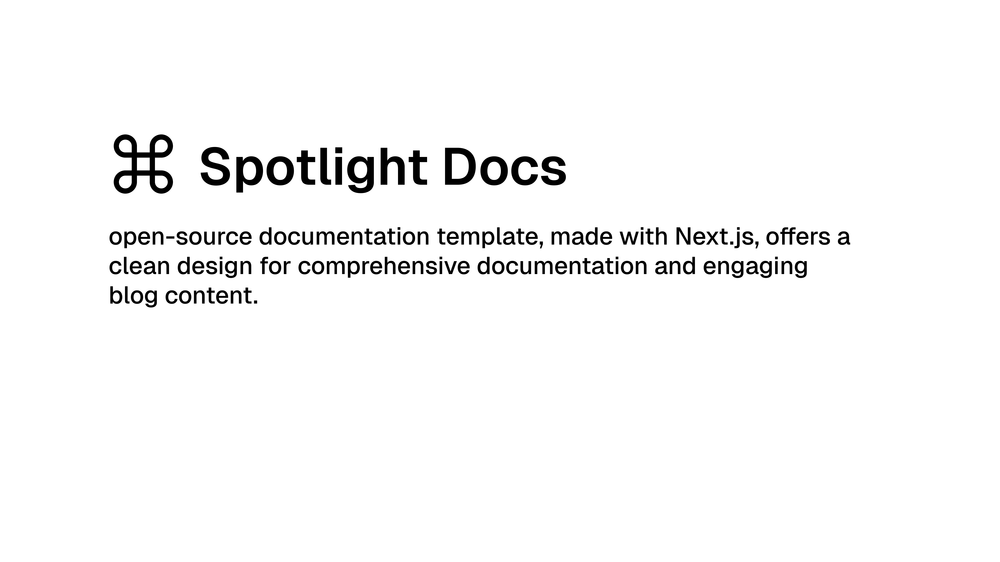

## Spotlight Docs -  Documentation Template

A versatile, open-source documentation template supporting multiple frameworks.




### Templates

- **Next.js Base:** Full-featured documentation with SSR and SSG.  
  [View Template](https://github.com/exionstech/spotlight-docs/tree/master/nextjs-base)


### Quick Start

Create a new project:

```plaintext
npx spotlight-cli <template> <project-directory>
```

### Deploy

| Template            | Deploy Link                                                                                                                                                                                                                                             |
| ------------------- | ------------------------------------------------------------------------------------------------------------------------------------------------------------------------------------------------------------------------------------------------------- |
| Next.js Base        | [](https://vercel.com/new/clone?repository-url=https://github.com/exionstech/spotlight-docs&project-name=nextjs-base&root-directory=nextjs-base)                                                                          |

### Features

- SSR and SSG Support
- Multiple Frameworks (Next.js, React Router, TanStack Router)
- MDX for Interactive Docs
- TOC with Scroll Highlight
- Dark Mode
- i18n for Multilingual Docs
- Static and Dynamic Routing

### Support

Please consider sponsoring to keep this project alive.  
[Sponsor Me](https://github.com/sponsors/exionstech)
